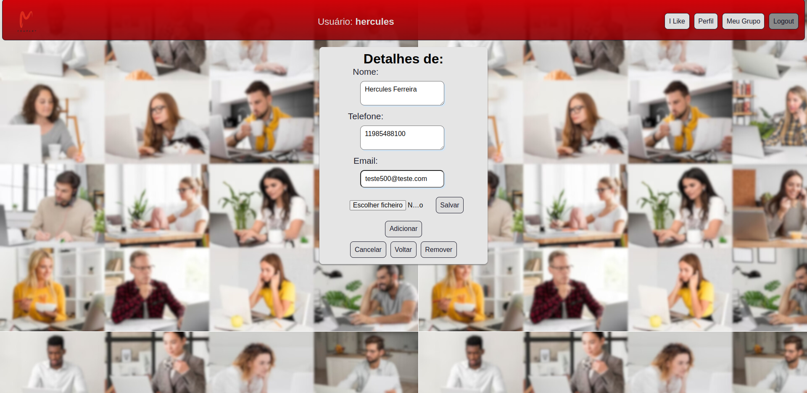

  

<h1>
Conheça a sua Intranet</h1>

<h1>
Descubra quem é o seu grupo aqui!
</h1>

<h1>
Índice</h1>

- [Sobre o site](#Sobre-o-Site)
- [Funcionalidades](#Funcionalidades)
- [Home](#Home)
- [Área para Administradores](#Área-para-Administradores)
- [Área de usuários](#Área-de-usuários)
- [Tipos de acesso ao Site](#Tipos-de-acesso-ao-Site)
- [Botões Navbar](#Botões-Navbar)
- [Área admin](#Área-admin)
- [Listando I like](#Listando-I-like)
- [Adicionando I like](#Adicionando-I-like)
- [Visualizando I like de um usuário do Grupo](#visualizando-I-like-de-um-usuário-do-grupo)
- [Visualizando seu próprio I like](#Visualizando-seu-próprio-I-like)
- [Validações e proteção de informações incorretas](#Validações-e-proteção-de-informações-incorretas)
- [Cadastro-de-usuários](#Cadastro-de-usuários)
- [Fazendo login](#Fazendo-login)
- [Metas](#Metas)
- [Objetivos](#Objetivos)
- [Novas Versões](#Novas-Versões)
- [Issues](#Issues)
- [License](#License)
- [Contribuição](#Contribuição)

<h1>
Sobre o Site</h1>

📜 Para a confecção do site, as principais ferramentas utilizadas, foram: React, JS ES6.
 
📜 Neste trabalho optei por não utilizar bibliotecas prontas, como Material-UI, Bootstrap, formik, ou core UI.
 
📜 Aqui o objetivo foi mostrar o máximo de conhecimento, desenvolvendo todas aplicações Hardcore Functional Programming, 
 
📜 A proposta principal dessa Intranet, é ter um canal direto com os colaboradores da empresa. 
 
📜 Assim, a empresa pode-se fazer o cadastro de cada colaborador, adicionar imagens, fazer edição, atualização, ou exclusão, seguindo o CRUD completo. 
 
📜 O colaborador tem sua área privativa, protegida por senha pessoal.
Nesta área é possível impulsionar suas principais qualificações, aptidões, o que ele está fazendo, como lendo um livro ou fazendo uma viagem, um curso ou uma Pós. Essa área foi denominada: <kbd>***I like***</kbd>.
 
📜 Desta forma a empresa, pode atuar em duas grandes frentes. Ter um cadastro atualizado de funcionários, bem como ter um termômetro individual de cada colaborador.
 
📜 Neste sentido, se tem uma atenção especial na experiência de employer branding, melhorando informações como: menor turnover e mais horas dedicadas, fortalecimento da cultura e clima organizacional  da empresa. 
 
📜 Quando o colaborador na sua área <kbd>***I like***</kbd> adiciona informações, pode disparar marcadores, de nível de informação intelectual de cada um, nível de satisfação individual e social, quando o colaborador usa suas horas vagas, para realmente praticar atividades de lazer.
 

<h1>
🛠 Funcionalidades</h1>

📌 [Home](https://github.com/ai/size-limit#readme) - Na Página inicial tem as informações atualizadas, e informações de como o site é, e uma prévia das opções que cada colaborador irá encontrar. No menu acima, no Navbar o usuário encontra os links para ir para área de Login ou Signup.
Também existe um carrossel infinito que fica passando as imagens dos colaboradores.  

  
   
  
  📌 [Home](https://github.com/ai/size-limit#readme) - Quando o mouse passa pela foto, foi colocado uma escala para aumentar o tamanho da foto, para melhorar a experiencia o usuário. 
    
    
   
  

   
  

📌 [Área para Administradores](https://github.com/ai/size-limit#readme) - Área privativa com nível de acesso apenas para administradores.

📌 [Área de usuários](https://github.com/ai/size-limit#readme) - Área privativa de cada colaborador protegida com senha pessoal.

<h1>
📈 Exemplos de uso do Site
</h1>

📌 [Tipos de acesso ao Site](https://github.com/ai/size-limit#readme) - Área do grupo, com todos colaboradores cadastrados.
  
   

  📌 [botões Navbar](https://github.com/ai/size-limit#readme) - Há um Navbar, na área central mostra qual o usuário logado. Há também botões que só parecem para usuários logados. 
   

  📌 [Área admin](https://github.com/ai/size-limit#readme) - Aqui pode se ver os detalhes do colaborador com nível de administrador. 
  O colaborador com nível de admin. Tem acesso á todas áreas, e funções, podendo executar qualquer função de alteração de informações do qualquer usuário.

   
   
  
  📌 [Área admin](https://github.com/ai/size-limit#readme) - Edição de suas próprias informações.
  
   

  📌 [Área admin](https://github.com/ai/size-limit#readme) - Edição de informações de outro usuário.
  
  

   📌 [Listando I like](https://github.com/ai/size-limit#readme) - Para visualizar um <kbd>***I like***</kbd>, seu ou de outro usuário do seu grupo basta clicar botão no Navbar <kbd>***I like***</kbd> e verá uma lista de todos <kbd>***I like***</kbd>.
   
  

  📌 [Adicionando I like](https://github.com/ai/size-limit#readme) - Para Adicionar uma aptidão, um <kbd>***I like***</kbd> / <kbd>***Eu Gosto***</kbd> basta clicar no botão **Abir Formulário** que será aberto um formulário para a inclusão das informações.
  
  

  📌 [Visualizando I like de um usuário do Grupo](https://github.com/ai/size-limit#readme) - Se você quiser saber de um livro bom para ler, ou uma indicação de um lugar para ir, ou uma Pós para fazer, poderá dar uma olhadinha nos <kbd>***I like***</kbd> / <kbd>***Eu Gosto***</kbd>  de seus colegas do grupo, e curtir essa experiência de achar uma boa indicação.
  
  
  📌 [Área admin](https://github.com/ai/size-limit#readme) - Na imagem acima um usuário administrador está visualizando informações de outro usuário. Neste momento, o acesso é total, e todos botões são habilitados de edição ou exclusão das informações. 
     

  📌 [Usuário Comum: Visualizando I like de um usuário do Grupo](https://github.com/ai/size-limit#readme) - Esta etapa, um usuário comum, está visualizando as informações, de um outro usuário. Como usuário comum não tem privilégios sob outro usuário, os botões de edição e exclusão são ocultados, e o único botão que aparece é o botão  **Voltar**.

  
  
   

 
  📌 [Visualizando seu próprio I like](https://github.com/ai/size-limit#readme) - Você pode ver seus <kbd>***I like***</kbd> / <kbd>***Eu Gosto***</kbd>  e tem liberdade total para editar ou excluir a qualquer momento.  
  
  

  📌 [Fazendo login](https://github.com/ai/size-limit#readme) - Aqui é onde os usuários farão login e terão acesso a todas as suas informações.
  
  

  📌 [Validações e proteção de informações incorretas](https://github.com/ai/size-limit#readme) - Você precisa preencher todas as informações corretas para ter acesso a Intranet, ou o sistema retornará uma mensagem:   **campos obrigatórios**, **e-mail ou senha incorretos**.
  

  📌 [Cadastro de usuários](https://github.com/ai/size-limit#readme) - Aqui é onde é feito o cadastro dos usuários, também é necessário preencher todas as informações corretas para ter acesso a Intranet, ou o sistema retornará uma mensagem:  **campos obrigatórios** 
  
  

<h1>
📋 Metas
</h1>

> :construction: Novas Versões do Site :construction:

📌 [Objetivos](https://github.com/ai/size-limit#readme) do Site serão, colocar uma área com vários níveis de privilégios, de acordo com o cargo e função de cada colaborador.

📌 [Objetivos](https://github.com/ai/size-limit#readme) Construir uma área para que cada colaborador possa também colocar imagens de suas conquistas na sua área de  <kbd>***I like***</kbd> / <kbd>***Eu Gosto***</kbd>, ou imagens de suas realizações, como livros, ou lugares que visitou.

<h1>
📋 License
</h1>

To the extent possible under law, Hercules Ferreira Ribeiro has waived all copyright and related or neighboring rights to this work.

<h1>
🐛 Issues</h1>

Contate me através do github

<h1>
🚀 Contribuição
</h1>

1. Faça o _fork_ do projeto
2. Crie uma _branch_ para sua modificação (`git checkout -b meu-novo-recurso`)
3. Faça o _commit_ (`git commit -am 'Adicionando um novo recurso...'`)
4. _Push_ (`git push origin meu-novo-recurso`)
5. Crie um novo _Pull Request_

**Happy coding!** :heart:

  

[Back to top](#faqs)
